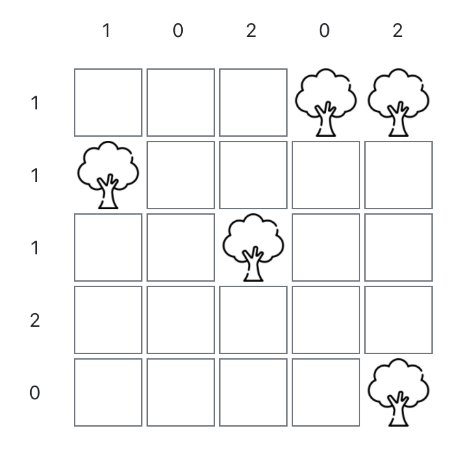
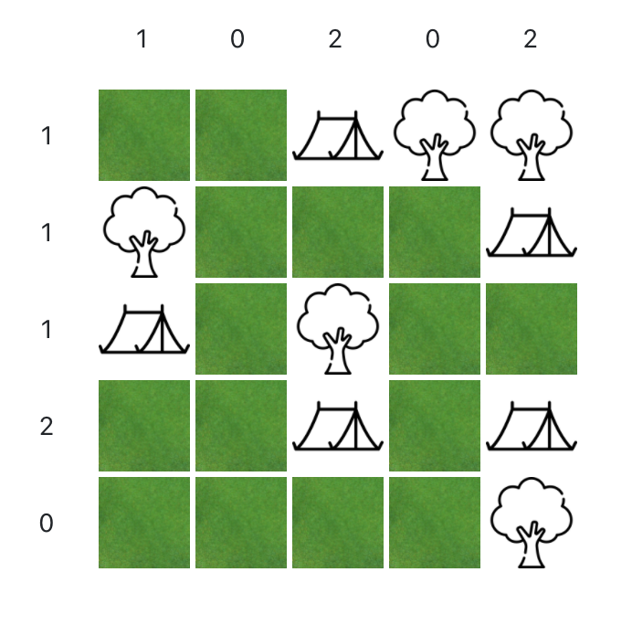

# Tents and Trees CSP Solver

A constraint-satisfaction problem (CSP) solver for _Tents & Trees_ logic puzzles. The project is written entirely in
Kotlin and implemented as a websocket-based client-server application using
the [KVision](https://github.com/rjaros/kvision) web framework.

## Tents & Trees

Invented in 1989 by Leon Balmaekers, Tents & Trees is about the correct placement of tents on a rectangular grid
containing some trees. The objective is to place a tent for each tree so that the following conditions are met:

* the tent stands horizontally or vertically next to its corresponding tree
* in each row and column there are as many tents as the number in the margin indicates
* two tents may not stand next to each other, not even diagonally

**Example**



<details>
  <summary>Solution</summary>

  
</details>

## CSP

Tents & Trees belongs to a class of combinatorial optimization problems that can be modeled as a constraint-satisfaction
problem (CSP). CSPs are composed of variables with possible values that fall into ranges known as domains and
constraints which impose restrictions on the possible variable assignments. In order to solve a constraint-satisfaction
problem, a well-formed assignment of the variables must be found which satisfies *all* constraints.

CSPs on finite domains are usually solved with some form of search, in this case using a backtracking algorithm.
Backtracking denotes a recursive depth-first algorithm that incrementally builds candidates to the solutions, and
abandons a candidate ("backtracks") as soon as it determines that the candidate cannot possibly be completed to a valid
solution.

The general procedure looks as follows:

```
function recursive-backtracking(assignment, csp):
    if assignment is complete:
        return assignment
    
    variable <- select-unassigned-variable(assignment, csp)
    values <- order-domain-values(variable, csp)
    
    for each value in values:
        if isConsistent(variable, value, csp):
            add {var = value} to assignment
            result <- recursive-backtracking(assignment, csp)
            if result is not failure:
                return result    
            remove {var = value} from assignment
        return failure
    
```

In its most basic form, the classic backtracking algorithm resembles a fairly naive brute-force approach. However, there
is some room for improvements to increase CSP performance and possibly reduce search effort.

For example, different heuristics can be applied that influence the precedence of the variables to be selected or the
order of the sampled domain values. In addition, preprocessing strategies can be used to systematically prune the possible values of the
variables before the actual backtracking starts. Further improvements can be achieved by applying
constraint propagation, i.e. when a value is assigned to the current variable, any value in the
domain of a "future" variable that conflicts with that assignment is (temporarily) removed from the domain.

This web application implements several of the previously mentioned strategies and allows them to be compared with each other.

## Heuristics

### Variable Selection Heuristics

_These heuristics influence which variable is selected next._

#### RandomVariableHeuristic

Selects a random variable that has not yet been assigned.

#### SelectFirstUnassignedVariableHeuristic

Selects the first variable in the list that has not yet been assigned.

#### MinimumRemainingValuesHeuristic

The unassigned variable with the fewest possible remaining values is selected. This is used to reduce the probability of
a failed assignment attempt.

#### MostConstrainingVariableHeuristic

The unassigned variable which, with its possible assinments, exerts the most constraints on other variables. This is
used to find possible failures as early as possible.

Further, combinations of heuristics can be used, such as

#### MostConstrainingVariableTieBreakerHeuristic

A combination of `MinimumRemainingValuesHeuristic` and `MostConstrainingVariableHeuristic`. Here the
MostConstrainingVariableHeuristic decides when the MRV heuristic has no information.

### Value Selection Heuristics

#### RandomValueOrderHeuristic

Selects a random value from the domain.

#### LexicographicDomainOrderHeuristic

The first value in the series of possible values is selected.

#### LeastConstrainingValueOrderHeuristic

The value that triggers the fewest constraints on other variables is selected.

## Gradle Tasks

### Compiling

* `compileKotlinFrontend` - Compiles frontend sources.
* `compileKotlinBackend` - Compiles backend sources.

### Running

* `frontendRun` - Starts a webpack dev server on port 3000
* `backendRun` - Starts a dev server on port 8080

### Packaging

* `frontendBrowserWebpack` - Bundles the compiled js files into `build/distributions`
* `frontendJar` - Packages a standalone "web" frontend jar with all required files into `build/libs/*.jar`
* `backendJar` - Packages a backend jar with compiled source files into `build/libs/*.jar`
* `jar` - Packages a "fat" jar with all backend sources and dependencies while also embedding frontend resources
  into `build/libs/*.jar`
